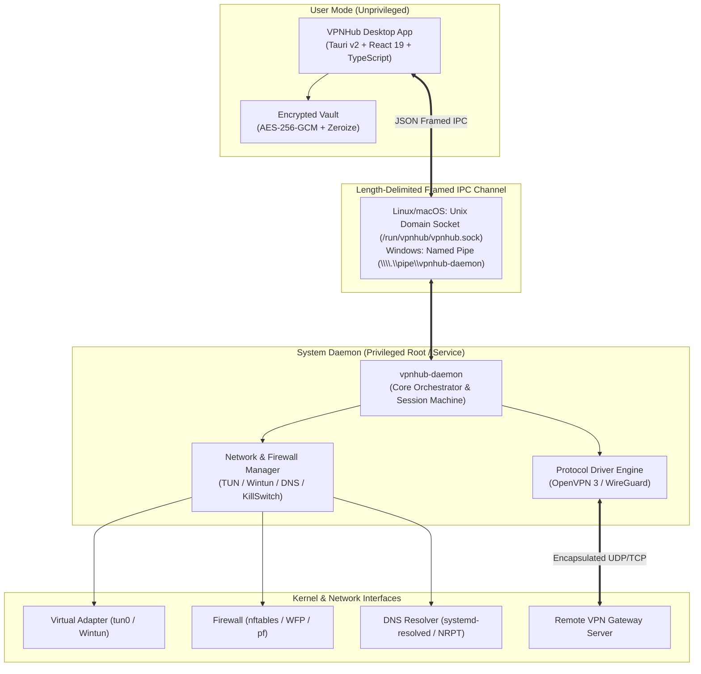

<p align="center">
  
</p>

<h1 align="center">VPNHub</h1>

<p align="center">
  <strong>Next-Generation, High-Performance, Privacy-First Desktop VPN Client & Privileged Daemon</strong>
</p>

<p align="center">
  <a href="https://github.com/Hephaestus-Studio/VPNHub/actions"></a>
  <a href="https://github.com/Hephaestus-Studio/VPNHub/releases"></a>
  
  
  
  <a href="LICENSE"></a>
</p>

---

## Overview

**VPNHub** is a modern, enterprise-ready VPN solution engineered for high throughput, airtight security, and intuitive user experience. Built with **Rust**, **Tauri v2**, and **React 19**, it separates privileged system network orchestration from unprivileged user interfaces through a high-speed asynchronous IPC protocol.

Whether connecting to corporate infrastructure, remote data centers, or secure cloud tunnels, VPNHub provides kernel-level routing precision, zero-touch DNS leak protection, firewall kill switches, dynamic 2FA/MFA, and real-time telemetry.

---

## Key Features

### Security & Kernel Orchestration

- **Privilege Separation Architecture**: The background daemon (`vpnhub-daemon`) executes with required system privileges (managing routing tables, virtual network adapters, and firewall rules), while the desktop GUI runs securely in unprivileged user mode.
- **Firewall Kill Switch**: Bulletproof protection against unexpected disconnects using native kernel firewalls:
  - **Linux**: Atomic `nftables` / `iptables` chains.
  - **Windows**: Windows Filtering Platform (WFP) callout filters.
  - **macOS**: `pf` packet filtering rules.
- **Zero-Touch DNS Leak Prevention**: Seamlessly intercepts and directs DNS queries strictly through the VPN tunnel (`systemd-resolved` DBus API on Linux, NRPT on Windows, `scutil` on macOS).
- **Smart LAN Bypass & Intranet-Only Routing**: Choose between full-tunnel routing or company-intranet-only split routing with customizable CIDR subnets.
- **Encrypted Vault Storage**: Profiles and credentials (passwords, private keys, certificates) are protected with **AES-256-GCM** hardware encryption and in-memory **Zeroize** sanitization.

### Networking & Protocol Engines

- **Pure-Rust OpenVPN 3 Protocol Stack**: Memory-safe parsing, handshake negotiation, cryptographic encapsulation, and high-performance packet pipelines without legacy C overhead.
- **Multi-Authentication Support**:
  - Username / Password authentication.
  - Time-based One-Time Password (TOTP / 2FA) with auto-token generation or prompt modes.
  - Mutual TLS (mTLS) with Client Certificates (`.crt`) and Private Keys (`.key`).
  - Inline `<tls-auth>` and `<tls-crypt>` directional packet signing and encryption.
- **Split Tunneling (App Rules)**: Route specific applications through the secure VPN tunnel or bypass local traffic directly to your physical gateway.
- **WireGuard Support**: Native WireGuard driver architecture _(in active development / coming soon)_.

### Modern Desktop Interface

- **Cockpit Dashboard**: Live kernel telemetry charts, real-time download/upload bandwidth sparklines, ping latency monitoring, and instant server switching.
- **Dynamic System Tray**: Minimalist tray menu with in-place D-Bus status updates, quick connect/disconnect toggles, and autostart support.
- **Zero-Lag Lifecycle & Auto-Teardown**: Quitting the desktop application instantly and cleanly tears down active tunnels and restores host routing.
- **Multi-Language (i18n)**: Native multilingual support for **English**, **Tiếng Việt**, **Français**, and **中文 (简体)**.
- **Built-in Diagnostic Suite**: Interactive real-time log streamer, audit ring buffer, and one-click diagnostic log export.

---

## Architecture & Monorepo Structure



### Workspace Directory Layout

```text
vpnhub/
├── crates/                    # Core Pure-Rust Libraries
│   ├── ovpn-config/           # Parser & validator for OpenVPN (.ovpn) configurations
│   ├── ovpn-core/             # Tunnel engine, state machines, packet processing pipeline
│   ├── ovpn-crypto/           # Cryptographic primitives, key derivation, Zeroize wiping
│   ├── ovpn-protocol/         # Network frame definitions, control/data channels, TLS framing
│   ├── ovpn-transport/        # Asynchronous UDP/TCP transport drivers
│   └── ovpn-tun/              # Virtual network interface driver (Linux TUN & Windows Wintun)
├── packages/
│   ├── app/                   # Desktop UI Application (Tauri v2 + Vite + React 19)
│   │   ├── src/               # React UI views, Mantine components, Zustand stores, i18n
│   │   └── src-tauri/         # Tauri backend, native window handlers, tray menu, IPC client
│   └── daemon/                # System Background Daemon (vpnhub-daemon)
├── .github/workflows/         # Automated multiplatform CI/CD and release packaging
├── cliff.toml                 # Automated changelog configuration (git-cliff)
└── DEVELOPMENT.md             # Comprehensive developer and packaging guide
```

---

## Getting Started

### Prerequisites

- **Rust Toolchain**: `stable` (>= 1.80) — [Install rustup](https://rustup.rs/)
- **Node.js & Package Manager**: Node.js >= 20 LTS and `pnpm` >= 9 (`npm i -g pnpm`)
- **System Libraries**:
  - **Ubuntu / Debian**:

    ```bash
    sudo apt-get update && sudo apt-get install -y \
      build-essential curl wget file libssl-dev libwebkit2gtk-4.1-dev \
      libayatana-appindicator3-dev librsvg2-dev libxdo-dev
    ```

  - **Fedora / RHEL**:

    ```bash
    sudo dnf install -y openssl-devel webkit2gtk4.1-devel \
      libayatana-appindicator-devel librsvg2-devel libxdo-devel
    ```

  - **Windows**: Visual Studio C++ Build Tools & WebView2 Runtime.
  - **macOS**: Xcode Command Line Tools (`xcode-select --install`).

---

### Local Development Setup

1. **Clone the repository:**

   ```bash
   git clone https://github.com/Hephaestus-Studio/VPNHub.git
   cd VPNHub
   ```

2. **Install Node.js dependencies:**

   ```bash
   pnpm install
   ```

3. **Run the privileged daemon:**

   ```bash
   # In terminal 1 (Requires root / administrative privileges):
   sudo ./target/debug/vpnhub-daemon
   # Or build & run directly:
   sudo cargo run --package vpnhub-daemon
   ```

4. **Launch the Tauri Desktop UI:**

   ```bash
   # In terminal 2:
   pnpm tauri dev
   ```

---

## Building & Distribution Packages

VPNHub supports building production-ready installer bundles for all desktop operating systems:

```bash
# Build production bundle for Linux (.deb, .rpm, .AppImage)
pnpm tauri build --bundles deb,appimage,rpm

# Build production bundle for Windows (.msi, .exe)
pnpm tauri build --bundles nsis,msi

# Build production bundle for macOS (.dmg, .app)
pnpm tauri build --bundles dmg,app
```

Artifacts are output to: `target/release/bundle/`.

---

## Installing Daemon as System Service

To run `vpnhub-daemon` automatically on startup:

### Linux (`systemd`)

```bash
# Copy binary
sudo cp target/release/vpnhub-daemon /usr/local/bin/

# Install service
sudo cp packages/daemon/vpnhub-daemon.service /etc/systemd/system/
sudo systemctl daemon-reload
sudo systemctl enable --now vpnhub-daemon.service
```

### Windows (`sc.exe` Service)

```cmd
sc create VPNHubDaemon binPath= "C:\Program Files\VPNHub\vpnhub-daemon.exe" start= auto
sc start VPNHubDaemon
```

---

## Security & Privacy Commitments

1. **Zero Telemetry Collection**: VPNHub does not collect, track, or transmit any user analytics, browsing history, or IP logs.
2. **Memory Safety**: Pure-Rust cryptographic routines wipe memory using the `zeroize` crate upon session termination.
3. **Hardened Credentials**: Private keys and certificates never leave the encrypted local vault unencrypted.

---

## Contributing

Contributions, bug reports, and feature requests are welcome!

1. Fork the Project.
2. Create your Feature Branch (`git checkout -b feat/AmazingFeature`).
3. Commit your Changes using Conventional Commits (`git commit -m 'feat(engine): add dynamic route optimizer'`).
4. Push to the Branch (`git push origin feat/AmazingFeature`).
5. Open a Pull Request.

Please see [DEVELOPMENT.md](DEVELOPMENT.md) for detailed contributing and architecture guidelines.

---

## License

This project is licensed under the **MIT License** — see the [LICENSE](LICENSE) file for details.

<p align="center">
  Made with ❤️ by <a href="https://github.com/Hephaestus-Studio">Hephaestus Studio</a>
</p>
